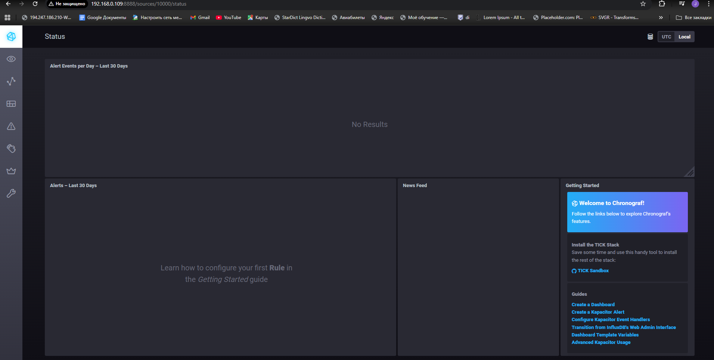

# Домашнее задание к занятию "13.Системы мониторинга"

## Обязательные задания

1. Вас пригласили настроить мониторинг на проект. На онбординге вам рассказали, что проект представляет из себя 
платформу для вычислений с выдачей текстовых отчетов, которые сохраняются на диск. Взаимодействие с платформой 
осуществляется по протоколу http. Также вам отметили, что вычисления загружают ЦПУ. Какой минимальный набор метрик вы
выведите в мониторинг и почему?
## Минимальный набор метрик
- CPU % (нагрузка вычислений)
- Memory (утечки)
- Disk space (отчеты на диск)
- HTTP requests/sec + latency (доступность)
- HTTP 5xx errors (ошибки)
#
2. Менеджер продукта посмотрев на ваши метрики сказал, что ему непонятно что такое RAM/inodes/CPUla. Также он сказал, 
что хочет понимать, насколько мы выполняем свои обязанности перед клиентами и какое качество обслуживания. Что вы 
можете ему предложить?
## Варианты:
- **SLA-метрики:**
  - Доступность (% времени сервис работает)
  - Производительность (% быстрых запросов)
  - Качество (% успешных отчетов)
- **Светофорная визуализация:** зеленый/желтый/красный
#
3. Вашей DevOps команде в этом году не выделили финансирование на построение системы сбора логов. Разработчики в свою 
очередь хотят видеть все ошибки, которые выдают их приложения. Какое решение вы можете предпринять в этой ситуации, 
чтобы разработчики получали ошибки приложения?
## Варианты:
- **Sentry** (free tier для ошибок)
- **Превратить логи в метрики** (счетчики ошибок в мониторинге)
- **Отправлять алерты** в Корпоративный Мессенджер/Telegram при ошибках
#
4. Вы, как опытный SRE, сделали мониторинг, куда вывели отображения выполнения SLA=99% по http кодам ответов. 
Вычисляете этот параметр по следующей формуле: summ_2xx_requests/summ_all_requests. Данный параметр не поднимается выше 
70%, но при этом в вашей системе нет кодов ответа 5xx и 4xx. Где у вас ошибка?
## Ошибка в SLA
Формула `summ_2xx_requests/summ_all_requests` не учитывает **3xx коды** - это тоже успех для клиента
**Правильно:** `(summ_2xx_requests + summ_3xx_requests) / summ_all_requests`
#
5. Опишите основные плюсы и минусы pull и push систем мониторинга.
## Push vs Pull
**Push (+):** гибкость, для облака, проще firewall  
**Push (-):** нагрузка на сервер, потеря данных

**Pull (+):** контроль нагрузки, автообнаружение  
**Pull (-):** сложнее firewall, медленное обнаружение падений
#
6. Какие из ниже перечисленных систем относятся к push модели, а какие к pull? А может есть гибридные?

    - Prometheus 
    - TICK
    - Zabbix
    - VictoriaMetrics
    - Nagios

## Классификация
- **Pull:** Prometheus, Nagios
- **Push:** TICK (Telegraf)
- **Гибрид:** Zabbix, VictoriaMetrics (оба подхода)

#
7. Склонируйте себе [репозиторий](https://github.com/influxdata/sandbox/tree/master) и запустите TICK-стэк, 
используя технологии docker и docker-compose.

В виде решения на это упражнение приведите скриншот веб-интерфейса ПО chronograf (`http://localhost:8888`). 

P.S.: если при запуске некоторые контейнеры будут падать с ошибкой - проставьте им режим `Z`, например
`./data:/var/lib:Z`


#
8. Перейдите в веб-интерфейс Chronograf (http://localhost:8888) и откройте вкладку Data explorer.
        
    - Нажмите на кнопку Add a query
    - Изучите вывод интерфейса и выберите БД telegraf.autogen
    - В `measurments` выберите cpu->host->telegraf-getting-started, а в `fields` выберите usage_system. Внизу появится график утилизации cpu.
    - Вверху вы можете увидеть запрос, аналогичный SQL-синтаксису. Поэкспериментируйте с запросом, попробуйте изменить группировку и интервал наблюдений.

Для выполнения задания приведите скриншот с отображением метрик утилизации cpu из веб-интерфейса.
. 
Добавьте в конфигурацию telegraf следующий плагин - [docker](https://github.com/influxdata/telegraf/tree/master/plugins/inputs/docker):
```
[[inputs.docker]]
  endpoint = "unix:///var/run/docker.sock"
```

Дополнительно вам может потребоваться донастройка контейнера telegraf в `docker-compose.yml` дополнительного volume и 
режима privileged:
```
  telegraf:
    image: telegraf:1.4.0
    privileged: true
    volumes:
      - ./etc/telegraf.conf:/etc/telegraf/telegraf.conf:Z
      - /var/run/docker.sock:/var/run/docker.sock:Z
    links:
      - influxdb
    ports:
      - "8092:8092/udp"
      - "8094:8094"
      - "8125:8125/udp"
```

После настройке перезапустите telegraf, обновите веб интерфейс и приведите скриншотом список `measurments` в 
веб-интерфейсе базы telegraf.autogen . Там должны появиться метрики, связанные с docker.

 - необязательно к выполнению

1. Вы устроились на работу в стартап. На данный момент у вас нет возможности развернуть полноценную систему 
мониторинга, и вы решили самостоятельно написать простой python3-скрипт для сбора основных метрик сервера. Вы, как 
опытный системный-администратор, знаете, что системная информация сервера лежит в директории `/proc`. 
Также, вы знаете, что в системе Linux есть  планировщик задач cron, который может запускать задачи по расписанию.

Суммировав все, вы спроектировали приложение, которое:
- является python3 скриптом
- собирает метрики из папки `/proc`
- складывает метрики в файл 'YY-MM-DD-awesome-monitoring.log' в директорию /var/log 
(YY - год, MM - месяц, DD - день)
- каждый сбор метрик складывается в виде json-строки, в виде:
  + timestamp (временная метка, int, unixtimestamp)
  + metric_1 (метрика 1)
  + metric_2 (метрика 2)
  
     ...
     
  + metric_N (метрика N)
  
- сбор метрик происходит каждую 1 минуту по cron-расписанию

Для успешного выполнения задания нужно привести:

а) работающий код python3-скрипта,

б) конфигурацию cron-расписания,

в) пример верно сформированного 'YY-MM-DD-awesome-monitoring.log', имеющий не менее 5 записей,

P.S.: количество собираемых метрик должно быть не менее 4-х.
P.P.S.: по желанию можно себя не ограничивать только сбором метрик из `/proc`.

2. В веб-интерфейсе откройте вкладку `Dashboards`. Попробуйте создать свой dashboard с отображением:

    - утилизации ЦПУ
    - количества использованного RAM
    - утилизации пространства на дисках
    - количество поднятых контейнеров
    - аптайм
    - ...
    - фантазируйте)
    
    ---

### Как оформить ДЗ?

Выполненное домашнее задание пришлите ссылкой на .md-файл в вашем репозитории.

---


# InfluxData 1.x Sandbox

***[InfluxDB 2.x is now available](https://portal.influxdata.com/downloads/) and available via [Docker Hub](https://hub.docker.com/_/influxdb).  
InfluxDB 2.x includes a native user interface, batch-style task processing and more. [Get Started Here!](https://docs.influxdata.com/influxdb/v2.0/get-started/)***

This repo is a quick way to get the entire 1.x TICK Stack spun up and working together. It uses [Docker](https://www.docker.com/) to spin up the full TICK stack in a connected 
fashion. This is heavily tested on MacOS and should mostly work on Linux and Windows.

To get started you need a running docker installation. If you don't have one, you can download Docker for [Mac](https://www.docker.com/docker-mac) or [Windows](https://www.docker.com/docker-windows), or follow the installation instructions for Docker CE for your [Linux distribution](https://docs.docker.com/engine/installation/#server).

### Running

To run the `sandbox`, simply use the convenient cli:

```bash
$ ./sandbox
sandbox commands:
  up           -> spin up the sandbox environment (add -nightly to grab the latest nightly builds of InfluxDB and Chronograf)
  down         -> tear down the sandbox environment
  restart      -> restart the sandbox
  influxdb     -> attach to the influx cli
  flux         -> attach to the flux REPL

  enter (influxdb||kapacitor||chronograf||telegraf) -> enter the specified container
  logs  (influxdb||kapacitor||chronograf||telegraf) -> stream logs for the specified container

  delete-data  -> delete all data created by the TICK Stack
  docker-clean -> stop and remove all running docker containers
  rebuild-docs -> rebuild the documentation container to see updates
```

To get started just run `./sandbox up`. You browser will open two tabs:

- `localhost:8888` - Chronograf's address. You will use this as a management UI for the full stack
- `localhost:3010` - Documentation server. This contains a simple markdown server for tutorials and documentation.

> NOTE: Make sure to stop any existing installations of `influxdb`, `kapacitor` or `chronograf`. If you have them running the Sandbox will run into port conflicts and fail to properly start. In this case stop the existing processes and run `./sandbox restart`. Also make sure you are **not** using _Docker Toolbox_.

Once the Sandbox launches, you should see your dashboard appear in your browser:


You are ready to get started with the TICK Stack!

Click the Host icon in the left navigation bar to see your host (named `telegraf-getting-started`) and its overall status.


You can click on `system` hyperlink to see a pre-built dashboard visualizing the basic system stats for your
host, then check out the tutorials at `http://localhost:3010/tutorials`.

If you are using the nightly builds and want to get started with Flux, make sure you check out the [Getting Started with Flux](./documentation/static/tutorials/flux-getting-started.md) tutorial.

> Note: see [influx-stress](https://github.com/influxdata/influx-stress) to create data for your Sandbox.


